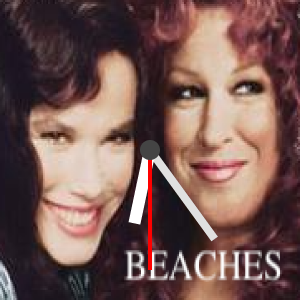

# fitbit watch faces

I ported the Pebble watchfaces I made to Fitbit, but then realized I can't publish them without an actual watch.

## Oblique-Strategies

This will give you one of Brian Eno's [Oblique Strategies](https://en.wikipedia.org/wiki/Oblique_Strategies) or the time, whenever you tap on the face.

## Beaches

If you like ["Beaches"](https://www.imdb.com/title/tt0094715/) or ["Spy"](https://www.imdb.com/title/tt3079380/), you'll love this watch.